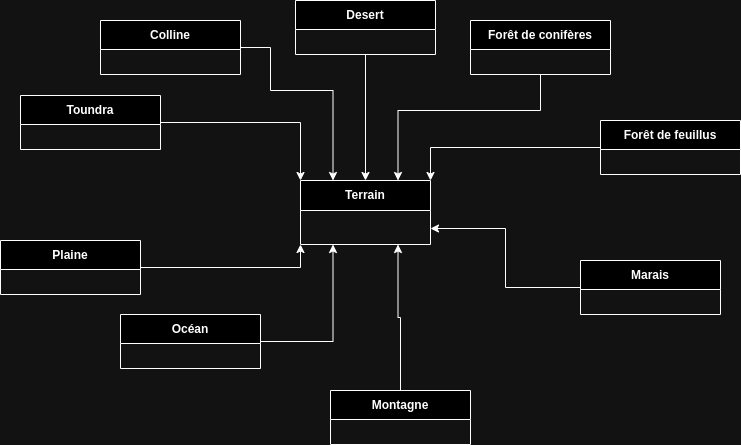

## QUESTIONS :

 - Pourquoi l'attribut graine est-il en final ?

L'attribut graine est en final car la graine utilisée pour la génération de l'aléatoire ne changera pas au cours de l'exécution du programme et ne DEVRA pas être changée.

 - Réaliser l'architecture que prendrait la forme d'une telle modélisation sous forme d'un diagramme UML. Quelle serait la différence d'attributs et de méthodes entre ces classes ? Expliquer, en s'appuyant sur un exercice vu en cours, pourquoi c'est une mauvaise idée. Quelle est la solution qu'il faudrait préférer (et que l'on va préférer) ?

Ici les différentes classes auront les mêmes attributs (que l'on pourrait indiquer dans la classe mère) et aucune méthode.
Ce faisant il y aurait beaucoup de duplication de code inutile et on se perdrait facilement.
 Je recommande d'utiliser une énumération qui nous permettra de gérer tous les types de terrains simultanément et de facilement ajouter de nouveaux types de terrain.

 - Quel type utilisez vous ? (Dans le cadre des attributs de la classe Terrain)

On cherche à avoir des attributs suffisament précises (au moins en double précision), on déclarera donc les attributs de type double.